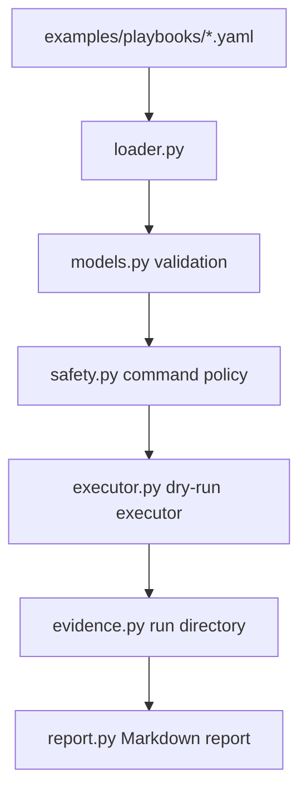

# Architecture

The architecture is intentionally local and conservative. The MVP does not connect to real infrastructure. It validates synthetic playbooks, records what would happen, and produces evidence suitable for review.
